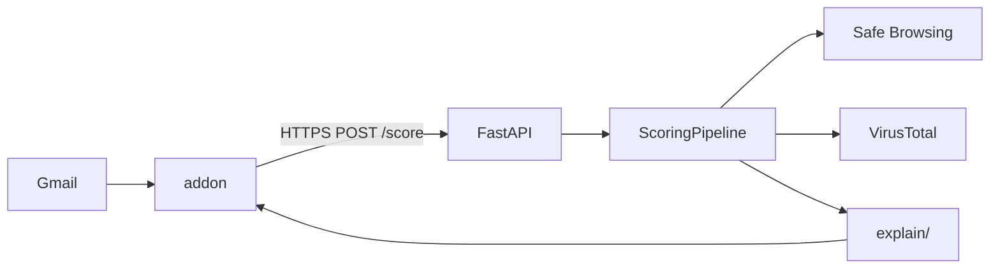

# gmail-threat-analyzer

gmail-threat-analyzer is a Gmail add-on plus a FastAPI backend. When someone opens a message, the add-on sends a capped snapshot of that email to the API. The API runs phishing checks, returns a score from 0–100, a verdict, and short explanations. Nothing is stored on the server and the add-on does not block mail.

---

## What the system does

1. User opens an email in Gmail.
2. The add-on (`onGmailMessageOpen`) reads sender, subject, links, snippet, attachment metadata, and `Authentication-Results`.
3. It builds JSON, signs it with HMAC, and `POST`s to `/score` over HTTPS.
4. The backend validates the request, runs detectors, optionally asks Safe Browsing / VirusTotal about links, builds a final score, and formats explanations.
5. The add-on renders a side-panel card with the verdict and reasons.

Main response fields:

- `score` — 0–100
- `verdict` — `safe`, `suspicious`, `dangerous`, or `critical`
- `reasons` — plain-language lines for the card
- `explanation` — brief text + optional detail groups
- `signals` — score contribution per category (headers, sender, urls, …)
- `confidence` — how tight the evidence is

Example (trimmed):

```json
{
  "score": 72,
  "verdict": "dangerous",
  "confidence": 0.81,
  "reasons": [
    "The sender domain does not match the company name in the display name.",
    "The message asks you to verify your account using an external link.",
    "The link uses a URL shortener."
  ],
  "explanation": {
    "brief_sentences": [
      "The sender does not look like who they claim to be.",
      "The message pushes you to act quickly on a login link."
    ],
    "verdict_guidance": {
      "summary": "Several warning signs were found.",
      "recommended_action": "Avoid links and attachments until you verify the sender."
    }
  }
}
```

Code lives in `addon/` (Apps Script) and `backend/` (Python). Schema version **1.1**; production bodies also include `request_id` and `issued_at`, both inside the signed payload.

---

## How to run the project

Pick the path that matches what you want to do:

| Goal | Section |
| --- | --- |
| Run the API on your machine (fastest) | [1. Backend only — Docker](#1-backend-only--docker) |
| Develop the API with hot reload / pytest | [2. Backend only — Python](#2-backend-only--python) |
| Use the add-on inside Gmail | [3. Full stack — Gmail + backend](#3-full-stack--gmail--backend) |
| Host the API on Render | [4. Backend on Render](#4-backend-on-render) |
| Run tests | [5. Tests](#5-tests) |

You need **Docker** or **Python 3.11+** for the backend. You need **Node.js 18+** only for the Gmail add-on. Gmail cannot call `http://127.0.0.1` — the add-on always needs an **HTTPS** URL for the API.

---

### 1. Backend only — Docker

Good for checking that the API builds and responds.

```bash
cd backend
docker build -t upwind-api .
docker run --rm -p 8000:8000 upwind-api
```

Check health:

```bash
curl http://127.0.0.1:8000/health
```

You should get a successful response. Scoring is `POST http://127.0.0.1:8000/score`.

This run has **no HMAC** (fine for local curl tests). Optional keys: copy `backend/.env.example` to `backend/.env` and pass them in:

```bash
docker run --rm -p 8000:8000 --env-file .env upwind-api
```

**Production-like Docker** (signed requests, same as Render):

```bash
docker run --rm -p 8000:8000 \
  -e ENVIRONMENT=production \
  -e HMAC_SECRET="pick-a-long-random-secret" \
  upwind-api
```

---

### 2. Backend only — Python

Use this for day-to-day backend work (`--reload`, breakpoints, `pytest`).

```bash
cd backend
python -m venv .venv
```

Activate the venv:

- **Windows (PowerShell):** `.\.venv\Scripts\Activate.ps1`
- **macOS / Linux:** `source .venv/bin/activate`

```bash
pip install -e ".[dev]"
uvicorn app.main:app --reload --host 127.0.0.1 --port 8000
```

```bash
curl http://127.0.0.1:8000/health
```

Copy `backend/.env.example` → `backend/.env` for optional API keys (`GOOGLE_SAFE_BROWSING_API_KEY`, `VIRUSTOTAL_API_KEY`). Restart uvicorn after editing `.env`.

More API notes: [backend/README.md](backend/README.md).

---

### 3. Full stack — Gmail + backend

You run the API somewhere Gmail can reach over HTTPS, then push the add-on and point it at that URL.

#### Step A — Start the API

**Option A1 — Render (easiest for demos)**  
Follow [4. Backend on Render](#4-backend-on-render). You get a URL like `https://your-app.onrender.com`.

**Option A2 — Local API + HTTPS tunnel**  
Start the backend (Docker or Python from sections 1–2), then expose port 8000:

```bash
# Example with ngrok (install ngrok first)
ngrok http 8000
```

Use the `https://….ngrok-free.app` URL (or Cloudflare Tunnel equivalent) as your public API base.

For production-like signing locally, run the API with:

```bash
# Docker example
docker run --rm -p 8000:8000 \
  -e ENVIRONMENT=production \
  -e HMAC_SECRET="same-secret-as-addon-below" \
  upwind-api
```

Pick one secret string and use it in both the backend and add-on.

#### Step B — Set up the add-on

```bash
cd addon
npm install
```

1. Create a project at [script.google.com](https://script.google.com/) (standalone), or:
   ```bash
   npx clasp create --type standalone --title "Malicious Email Scorer"
   ```
2. Copy `addon/.clasp.json.example` → `addon/.clasp.json` and set `"scriptId"` from Apps Script → Project settings.
3. Log in and push:
   ```bash
   npm run clasp:login
   npm run clasp:push
   npm run clasp:open
   ```
4. In the script editor: **Project settings → Script properties** — add:

   | Property | Example |
   | --- | --- |
   | `BACKEND_BASE_URL` | `https://your-app.onrender.com` or your ngrok URL (no trailing `/`) |
   | `HMAC_SECRET` | Same as backend if HMAC is enabled |

5. Link a Google Cloud project to the script, set up the **OAuth consent screen**, and add yourself as a **test user** while the app is in Testing mode.

#### Step C — Try it in Gmail

Open any message in Gmail. The add-on panel should load and show a score card after it calls `POST /score`.

If you see auth errors: `HMAC_SECRET` must match on both sides, and production requires `request_id` + `issued_at` in the body (the add-on adds these when configured for production).

More add-on detail: [addon/README.md](addon/README.md).

---

### 4. Backend on Render

1. In [Render](https://render.com), create a **Web Service** from this repo.
2. Set **Root directory** to `backend` (Dockerfile: `backend/Dockerfile`).
3. Add environment variables:

   | Variable | Value |
   | --- | --- |
   | `ENVIRONMENT` | `production` |
   | `HMAC_SECRET` | Long random string (same as add-on Script property) |
   | `GOOGLE_SAFE_BROWSING_API_KEY` | Optional |
   | `VIRUSTOTAL_API_KEY` | Optional |

4. Deploy. Open `GET https://<your-service>.onrender.com/health` in a browser.
5. Set add-on `BACKEND_BASE_URL` to `https://<your-service>.onrender.com`.

If `ENVIRONMENT=production` and `HMAC_SECRET` is empty, `/score` returns **503**. Use one instance/worker if you rely on in-memory replay protection.

---

### 5. Tests

Backend:

```bash
cd backend
pip install -e ".[dev]"   # if not already installed
pytest
```

Add-on contract tests:

```bash
cd addon
npm install
npm run test:contract
```

Optional live Safe Browsing / VirusTotal (needs real keys and network):

```bash
cd backend
set RUN_REPUTATION_LIVE=1    # Windows cmd
# export RUN_REPUTATION_LIVE=1   # macOS/Linux
pytest src/tests/test_reputation_live.py -v
```

---

### Environment variables (reference)

| Variable | When | Purpose |
| --- | --- | --- |
| `ENVIRONMENT` | Render / prod | `production` → require HMAC + replay fields on `/score` |
| `HMAC_SECRET` | Render / prod | Shared secret; add-on sends `X-Body-Signature` |
| `HMAC_SECRET_PREVIOUS` | Rotation | Accept old secret during key swap |
| `GOOGLE_SAFE_BROWSING_API_KEY` | Optional | Link threat lookup |
| `VIRUSTOTAL_API_KEY` | Optional | URL scanner lookup |
| `SCORE_MAX_SKEW_SECONDS` | Optional | Max clock skew for `issued_at` (default `120`) |
| `REPLAY_REQUEST_ID_TTL_SECONDS` | Optional | How long to reject duplicate `request_id` (default `300`) |

Full list: `backend/.env.example`.

---

## Gmail add-on and backend

**Add-on (`addon/src/`)** — Card Service UI, Gmail read, payload build (`Features.gs`), HMAC signing (`BackendClient.gs`), verdict card (`ScoreCard.gs`). Advanced Gmail API is enabled only to read `Authentication-Results`. Outbound fetch is limited to HTTPS hosts in `appsscript.json` (e.g. `*.onrender.com`).

**Backend (`backend/src/app/`)** — FastAPI app. `POST /score` goes through security checks, then `ScoringPipeline`, then JSON back. No database, no queue.



---

## Scoring flow (end to end)

Inside `ScoringPipeline.score()` (`backend/src/app/scoring/pipeline.py`):

1. **Reputation** — Up to 6 URLs, sanitized, sent to Safe Browsing (batch) and VirusTotal (per URL) if keys exist.
2. **Brand impersonation** — Brand names in subject/body vs sender domain and links.
3. **Auth band** — SPF/DKIM/DMARC summary from headers.
4. **Legitimacy** — Is this likely a real receipt, workflow tool mail, or neutral/hostile?
5. **Signal families** — Headers, sender (+ brand), URLs, content/urgency, attachments. Each returns findings and a 0–100 chunk.
6. **Urgency dampening** — Trusted auth can lower urgency contribution.
7. **Weighted blend** — Families combined using weights in `weights.py`.
8. **Combo rules** — Extra points when known phish patterns match (e.g. credential text + bad link).
9. **Caps and floors** — Critical cap if only urgency fired; reputation floor if SB flags a link and local signals are already bad.
10. **Verdict** — Integer score → `safe` / `suspicious` / `dangerous` / `critical`.
11. **Explain** — Internal reason codes → user-facing copy.

Local rules always run. If VT or Safe Browsing fails or has no key, you still get a score from steps 2–10.

### Verdict bands

| Verdict | Score |
| --- | --- |
| Safe | 0–28 |
| Suspicious | 29–52 |
| Dangerous | 53–77 |
| Critical | 78–100 |

### How families combine

Each family scores 0–100 from its findings (low / medium / high). Then:

| Family | Weight |
| ---: | ---: |
| Headers | 10% |
| Sender (+ brand) | 24% |
| URLs | 22% |
| Content / urgency | 16% |
| Attachments | 12% |
| Reputation overlay | 16% |

Repeated highs in one family are capped (e.g. multiple risky URLs do not stack forever). Weights are in `backend/src/app/scoring/weights.py`.

### Combo rules

`backend/src/app/scoring/combos/` tags the message (e.g. `credential_request`, `external_link`, `login_like_path`) and adds a bounded boost when patterns look like real phish: login lure + off-domain link, bank wording + fake security alert, invoice + executable attachment, etc. Total combo boost is capped so it nudges the score rather than dominating it.

---

## What we check (detectors)

### Sender and authentication

**Headers (`signals/headers.py`)** — Parses `Authentication-Results` for SPF, DKIM, DMARC (`pass` / `fail` / `none`). Weak or failing auth increases risk.

**Sender (`signals/sender.py`)** — Display name vs `From` address, reply-to mismatch, generic security-team names, lookalike domains, homoglyphs (e.g. `rn` vs `m`), subdomain tricks.

**Brand impersonation (`signals/brand_impersonation.py`)** — Loads a brand registry (`scoring/data/brands.json`). If the message mentions PayPal, Microsoft, etc. but the sender domain is unrelated, or links point somewhere that does not match the brand, that feeds the sender family.

### URLs and links

**URLs (`signals/urls.py`)** — For each link (from the payload list and parsed hrefs):

- Off-domain vs sender (with workflow/brand exceptions when legitimacy is high)
- URL shorteners, suspicious TLDs, `http://`, IP literals, punycode
- Paths that look like login pages (`/login`, `/verify`, …)
- Display text vs real href mismatch
- Nested/query-wrapped URLs

Login-style paths and external links matter most when combined with phishy content (combo rules use tags like `login_like_path`).

### Phishing wording and urgency

**Content (`signals/content/`)** — Regex/pattern detectors on subject + snippet, each with its own cap so one phrase cannot blow up the score:

- Account verification / password reset language (`credential.py`)
- Fake “unusual sign-in” or security alerts (`fake_security.py`)
- Money transfer, invoice, payment demands (`financial.py`, `invoice.py`)
- OTP / MFA codes (`otp.py`)
- Requests for SSN, card, etc. (`sensitive.py`)
- Crypto refund scams (`crypto_refund.py`)
- Fake delivery / package problems (`delivery.py`)
- Social engineering (“CEO urgent wire”) (`social_engineering.py`)
- Time pressure (“within 24 hours”, “account suspended”) (`urgency.py`)

Urgency alone cannot push **Critical**; the engine requires corroboration from URLs or identity (`apply_critical_cap_for_urgency_isolation`).

### Attachments

**Attachments (`signals/attachments.py`)** — Metadata only (name, MIME, size). No file bytes are uploaded or scanned.

Flags include: `.exe` / script types, double extensions (`invoice.pdf.exe`), archives, macro-enabled Office, password-protected zips, HTML/SVG attachments, misleading names. Findings stack with a cap similar to URLs.

### Safe Browsing and VirusTotal

After local URL analysis, up to **6** sanitized URLs may leave the server:

- **Safe Browsing** — `threatMatches:find` batch call.
- **VirusTotal** — v3 URL report per URL.

Results feed the **reputation** family (16% weight). If a key is missing, status is `skipped_no_api_key` and the rest of the pipeline is unchanged. Timeouts (~2.5s) become `error_timeout` / `error_http`; the request still completes.

**Before any outbound call**, `url_sanitizer.py`:

- Normalizes the URL
- Strips query keys like `token`, `password`, `session`
- Blocks private, loopback, link-local, and reserved IPs (SSRF protection)
- Drops malformed or overlong URLs

Call volume is limited in-process; HTTP 429 from a vendor triggers a short cooldown (`reputation/guard.py`).

---

## Reducing false positives

Real mail (receipts, DocuSign, shipping updates) can look like phish. `legitimacy.py` assigns a tier:

- **trusted_transactional** — Receipt/order language + aligned sender/brand
- **trusted_workflow** — Known workflow platforms (allowlists in `scoring/data/`)
- **partial_trust**, **neutral**, **hostile**

When trust is high and auth is solid:

- Urgency/content scores are reduced
- Some URL tags are softened for hosts that match the claimed brand
- Reputation overlay is lowered if vendors return clean
- **Critical** is blocked when only urgency/content fired with no URL/identity hit

Combo and URL logic also respect workflow allowlists so internal tool links are not treated like random external domains.

Regression fixtures under `backend/fixtures/scoring/benign/` lock expected behavior on legitimate samples.

---

## Explainability

Detectors emit internal reason codes (e.g. tied to finding tags). `backend/src/app/explain/`:

1. **Resolve** — Map each code to title, category, severity (`resolver.py`, copy registries).
2. **Synthesize** — Merge duplicates, pick key findings, attach auth/reputation context (`synthesis.py`).
3. **Brief** — A few sentences for the main card (`brief_copy.py`).
4. **Detail** — Grouped sections for “More details” (`detail_copy.py`).
5. **Guidance** — Verdict summary + what to do next (safe → read normally; critical → do not click if unsure).

The card does not show raw tags, full JSON, or vendor responses. Technical users expand detail groups; casual users read `reasons` and `brief_sentences`.

---

## API security (public backend)

On Render, `/score` is on the internet. Request handling order in `api/routes/score.py`:

1. **Rate limit** — 120 requests per minute per client IP (`api/security.py`).
2. **Body size** — Reject if larger than 256 KiB.
3. **HMAC** — If `HMAC_SECRET` is set, header `X-Body-Signature` must be hex HMAC-SHA256(secret, **exact raw body bytes**). Compared with `hmac.compare_digest`. Optional `HMAC_SECRET_PREVIOUS` for rotation.
4. **Parse JSON** — Pydantic `ScoreRequest`; strict max lengths on subject, snippet, URL count, etc. (`limits.py`).
5. **Replay** — In production, body must include `issued_at` (Unix ms) and `request_id` (UUID). Reject if clock skew > `SCORE_MAX_SKEW_SECONDS` (default 120s) or if the same `request_id` was seen recently (default 300s, in-memory per process).
6. **Score** — Engine runs; errors return generic messages, not stack traces.

**Production gate:** `ENVIRONMENT=production` requires `HMAC_SECRET`. Otherwise `/score` returns **503** so the API cannot run unsigned by accident.

**HTTPS:** Add-on only whitelists `https://` backends. Plain HTTP is not used for real traffic.

**Privacy:**

- No database, no scan history
- Logs record event names (e.g. `hmac_mismatch`, `rate_limit_blocked`), not bodies or full URLs
- Validation errors (**422**) do not echo user input back
- Reputation vendors receive sanitized URLs only, not subject/body/attachments

**Threats considered:** replay of signed requests, forged clients, abuse/volume, leaking mail via errors/logs, using reputation calls to probe internal networks (sanitizer), open unauthenticated scoring (production gate).

Replay cache is per instance — multiple replicas without sticky sessions weaken replay protection unless you add shared storage.

---

## Project structure

```text
upwind/
  README.md
  addon/
    src/                    # Apps Script (.gs), appsscript.json
    tests/                  # Contract tests
  backend/
    Dockerfile
    pyproject.toml
    .env.example
    src/app/
      api/                  # /score route, security, errors
      scoring/
        signals/            # headers, sender, urls, content, attachments, brand
        parsing/            # domains, brands, workflow, homoglyphs
        combos/             # cross-signal rules
        pipeline.py         # orchestration
        weights.py          # family weights and caps
        legitimacy.py       # false-positive control
      reputation/           # sanitizer, Safe Browsing, VirusTotal, guard
      explain/              # brief + detail copy
    src/tests/
    fixtures/scoring/       # benign + phishing JSON regressions
```

| Path | Role |
| --- | --- |
| `addon/src/ScoreCard.gs` | Card UI |
| `addon/src/Features.gs` | Payload caps and normalization |
| `addon/src/BackendClient.gs` | HTTPS + HMAC |
| `backend/src/app/scoring/engine.py` | Entry to pipeline |
| `backend/src/app/api/security.py` | HMAC, replay, rate limit |

---

## Testing

| What | How |
| --- | --- |
| Backend unit/integration | `cd backend && pytest` |
| Scoring regressions | `backend/fixtures/scoring/{benign,phishing}/` |
| Add-on payload shape | `cd addon && npm run test:contract` |
| Live SB/VT (optional) | Keys + `RUN_REPUTATION_LIVE=1` → `pytest src/tests/test_reputation_live.py` |
| Manual | Deploy or tunnel → Script properties → open mail in Gmail |

---

## Limitations

Not antivirus. Not a mail gateway. Attachment **contents** are never read. Only runs when the user opens a message. Newsletters and real invoices can still score high. Safe Browsing and VirusTotal need keys, quota, and network. Use the verdict as one signal—if something feels wrong, verify the sender your usual way.

---

*Ridmi*
