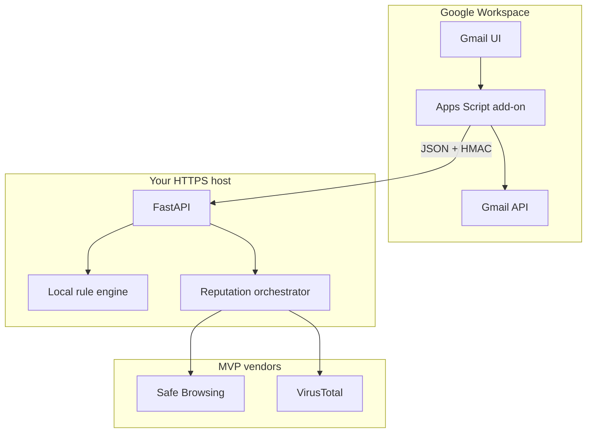

# Gmail Malicious Email Scorer

Contextual **Gmail add-on** plus **FastAPI** backend that estimates phishing / maliciousness risk from **bounded message features** (headers, URLs, snippet windows, attachment metadata). This is **not** an antivirus and **does not** store raw email, bodies, or scan history (stateless MVP).

## 1. Project overview

- **Users**: security-conscious Gmail users who want an explainable, on-open risk readout.
- **Surfaces**: Card UI in Gmail (Apps Script) and `POST /v1/score` on the backend (Phases 1–5).
- **Non-goals**: attachment malware scanning, full MIME pipelines, databases, ML-first black-box scoring, automated Gmail actions.

### Implementation phases (status)

| Phase | Scope | Status |
| --- | --- | --- |
| 1 | Backend API skeleton (`POST /v1/score`, Pydantic, tests) | **Completed** |
| 2 | Local rule-based scoring (engine + signal modules, no external APIs) | **Completed** |
| 3 | Reputation providers (Safe Browsing, VirusTotal) + merge | **Completed** |
| 4 | HMAC auth, rate limits, payload hardening | **Completed** |
| 5 | Gmail add-on live reads + card rendering | **Completed** |
| 6 | Demo polish, docs, walkthrough scenarios | **Active** (current) |

## 2. Demo quickstart (stub until Phase 6 polish)

1. Deploy or tunnel the backend over **HTTPS** (add-on requires `https://` targets only).
2. Configure Apps Script **Script properties** from `addon/script-properties.template`.
3. Push the add-on with **clasp** (`addon/README.md`).
4. Install the add-on on a test Workspace / consumer Gmail and open a message.

Detailed steps will be finalized after Phases 3–5 (OAuth, GCP project, install flow).

## 3. Architecture



See also [docs/architecture.md](docs/architecture.md).

## 4. Security decisions (summary)

- **Least-privilege Gmail scopes** in `addon/appsscript.json` (aligned with Advanced Gmail usage in Phase 5).
- **HTTPS only** from the add-on to your API (`openLinkUrlPrefixes` allowlists `https://`).
- **HMAC** (or equivalent) between add-on and backend — implemented in Phase 4; secret in Script Properties + `HMAC_SECRET` env.
- **Strict validation**, payload caps, rate limits — Phases 1 and 4.
- **No raw email storage**; minimize fields sent to third-party reputation APIs (IOC-only).

## 5. Privacy considerations

- **To your backend**: normalized, capped DTO (schema versioned; see `schema_version` in requests).
- **To vendors (Safe Browsing, VirusTotal)**: only the IOC strings their APIs require — **not** narrative body text.
- **Retention**: none by design (ephemeral requests).

## 6. Scoring logic (outline)

- **Verdict bands**: Low Risk 0–39, Suspicious 40–69, High Risk 70–100.
- **Confidence**: signal quality / coverage (not model softmax).
- **Local + reputation merge**: reputation augments within caps; local analysis always runs.
- **`reputation_notice`**: exact fallback string when no reputation contributed (see implementation plan §5.6).

## 7. Signals (outline)

1. Headers (SPF/DKIM/DMARC parsing, conservative unknowns).
2. Sender drift (Reply-To vs From, display-name heuristics).
3. URLs (shorteners, literals, TLD / IDN risk).
4. Urgency lexicon (bounded false-positive awareness).
5. Attachment metadata only (no byte scanning).
6. Reputation overlays (Safe Browsing + VirusTotal).

## 8. External integrations (MVP)

- **Google Safe Browsing** and **VirusTotal** — env vars in `backend/.env.example`; ~2–3 s per provider timeouts and a global reputation budget (Phase 3).
- Graceful degradation with structured `reputation` objects and correct `reputation_notice` semantics.

## 9. Local development

### Backend (uvicorn)

```bash
cd backend
python -m venv .venv
# Windows: .\.venv\Scripts\Activate.ps1
pip install -e ".[dev]"
uvicorn app.main:app --reload --host 127.0.0.1 --port 8000
```

- Health: `GET /health`
- More detail: [backend/README.md](backend/README.md)

### Gmail add-on (clasp)

```bash
cd addon
npm install
copy .clasp.json.example .clasp.json   # Windows: copy; Unix: cp
# Edit .clasp.json → real scriptId from script.google.com
npm run clasp:login
npm run clasp:push
```

See [addon/README.md](addon/README.md) for Script properties and GCP / OAuth checklist.

### Formatting / testing

```bash
cd backend
pytest
```

(Linters/formatters can be added in a later phase; keep installs minimal for now.)

## 10. Deployment (HTTPS)

Pick one managed host that gives you TLS and a stable URL, for example:

- **Google Cloud Run** (fits GCP + Gmail OAuth story)
- **Fly.io** or **Render**

The add-on’s `BACKEND_BASE_URL` Script property must be the public `https://` origin (no trailing slash). Local-only dev against Gmail UI requires an **HTTPS tunnel** to your machine.

## 11. Gmail add-on setup (checklist)

1. Create a **Google Cloud** project; enable the Apps Script API if using clasp.
2. Link the Apps Script project to that GCP project for OAuth branding.
3. Configure **OAuth consent** (test users while in testing).
4. `clasp create` / `clasp clone` / push from `addon/`.
5. Set **Script properties** using `addon/script-properties.template`.
6. Install the add-on on your mailbox and verify the contextual card opens.

## 12. Environment variables

| Variable | Where | Required | Purpose |
| --- | --- | --- | --- |
| `HMAC_SECRET` | backend `.env`, Script property | Phase 4+ | Shared signing secret |
| `GOOGLE_SAFE_BROWSING_API_KEY` | backend `.env` | Optional MVP | URL threat checks |
| `VIRUSTOTAL_API_KEY` | backend `.env` | Optional MVP | URL/domain reputation |
| `BACKEND_BASE_URL` | Script property | Yes for real calls | HTTPS API origin |
| `LOG_LEVEL`, `DEBUG_LOGGING` | backend `.env` | Optional | Logging hygiene |

Full template: `backend/.env.example`.

## 13. Trade-offs and limitations

Heuristic scoring only; marketing and IT mail can resemble phishing; bounded extracts miss deep HTML tricks; no attachment content analysis; vendor quotas and latency affect enrichment.

## 14. Demo walkthrough (to complete in Phase 6)

Scenarios: **healthy reputation**, **partial provider outage**, **full reputation outage** (expect the exact `reputation_notice` local-only string when no reputation contributed).

---

## Repository layout

```text
upwind/
  README.md                 ← this file
  .gitignore
  docs/
    architecture.md
  addon/
    appsscript.json
    package.json            ← clasp via npm scripts
    .clasp.json.example
    script-properties.template
    src/
      Main.gs
      GmailClient.gs
      Features.gs
      BackendClient.gs
      Config.gs
  backend/
    pyproject.toml
    README.md
    .env.example
    src/
      app/
        main.py
        routes_score.py
        schemas.py
        security.py
        limits.py
        constants.py
        scoring/…
        reputation/…
      tests/
        …
```

## Request `schema_version`

Clients send `schema_version` (currently **`1.0`**) in the JSON body; the server constant lives in `backend/src/app/constants.py`. Bump together when the DTO changes.
